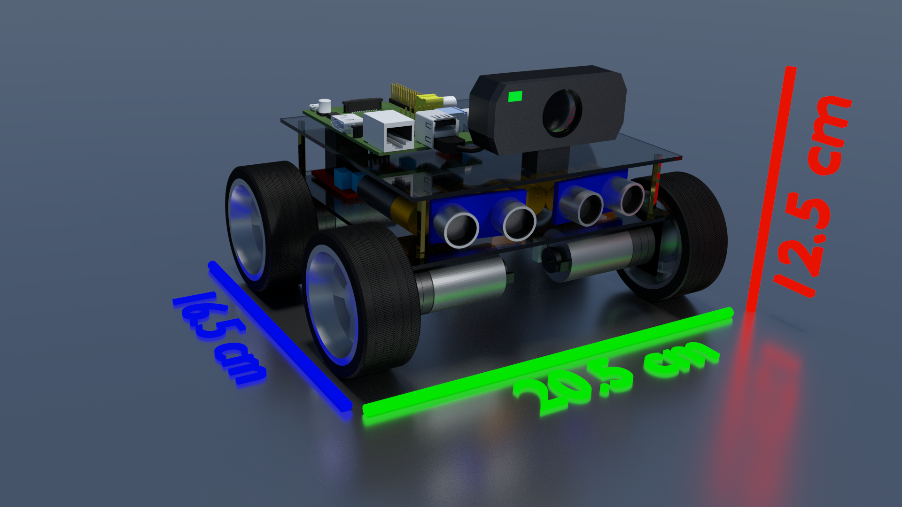
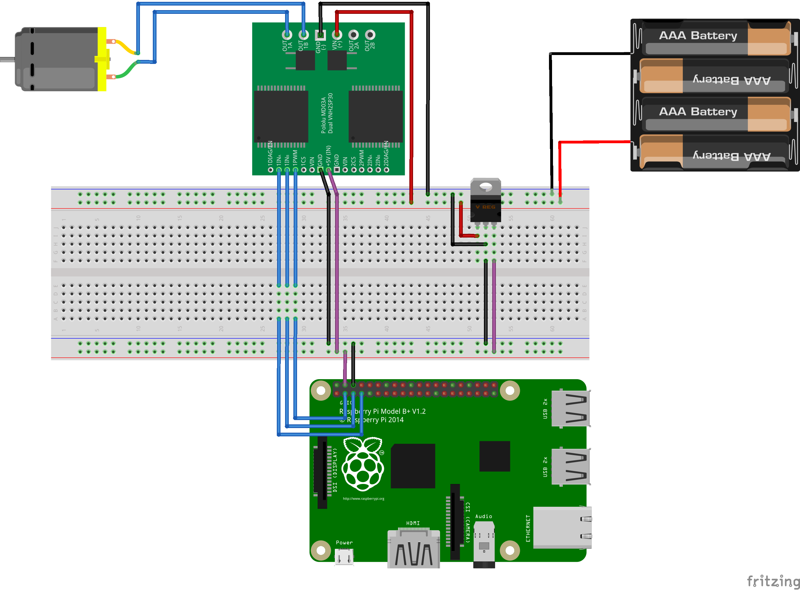
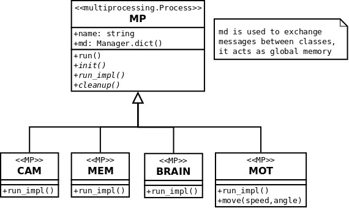

# PyPiBot

A robot that is controlled by python on a raspberry pi.
The build is rover-like, with four driven wheels.




## Parts-List
Whenever available, detailed information and supplier-link are provided as pdf in the docs-folder.
* Raspberry-Pi B+ V2
* Edimax EW-7811UN Wireless USB Adapter


* Motors: 4x DC 6.0V, 35:1 gear ratio, diameter of shaft: 4mm
* Motor-mounts: 4x DROK 25mm universal dc motor mount
* Motor-driver: 2x L298 dual H-bridge modules

* Tires: 4x GoolRC 1:10 Drift Car Tires
* Tire-mount: 12mm Hex Wheel Adapter for 4mm shaft

Current hardware configuration:


## Software
Basic module structure finished:
* Python mainloop with subprocesses for motor/sensor/worldmodel/reasoning control
* CAM: Sensing: camera + ultrasonic modules
* MEM: Worldmodel: 2D-map of environment
* BRAIN: Reasoning: Obstacle avoidance, object-tracking, self-loading and finding base
* MOT: Motor control: GPIO interfaced with motor-module, speed via PWM-implemention of pyGPIO

TODO:
* Define datatypes and interfaces (messages) for inter-process-communication
* Think about synchronization (in terms of time, perception/action cycle, etc.)
* How to organize perceptions, who marks them as read/removes them from the dictionary?
* Implement logging



## Setup and Installation

Edimax WLAN-Stick has a power-save mode and goes to sleep, to avoid this:
```
sudo vim /etc/modprobe.d/8192cu.conf
options 8192cu rtw_power_mgnt=0 rtw_enusbss=0
```
